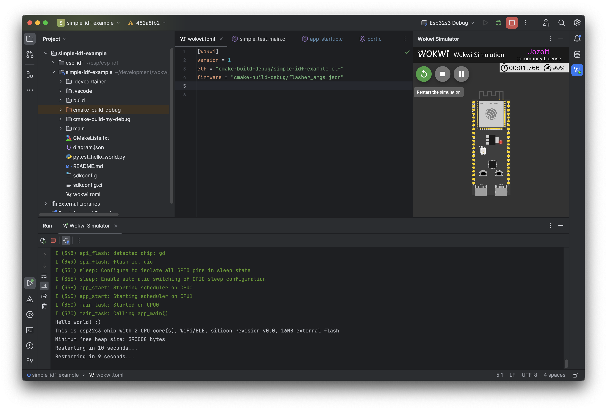

<!-- PROJECT SHIELDS -->
[![Contributors][contributors-shield]][contributors-url]
[![MIT License][license-shield]][license-url]
[![Issues][issues-shield]][issues-url]
[![Forks][forks-shield]][forks-url]
[![Stargazers][stars-shield]][stars-url]

<!-- PROJECT LOGO -->
 

  <a href="https://github.com/Jozott00/wokwi-intellij">
    <!-- 
    <picture>
      <source media="(prefers-color-scheme: dark)" srcset="./blob/imgs/pluginIcon_dark.svg" width="80" height="80">
      
    </picture>
    -->
    
  </a>
  

<h3 align="center">Wokwi Intellij Plugin</h3>

  

    Integrate Wokwi in Intellij-based Jetbrains IDEs.
     
    <a href="https://jozott00.github.io/wokwi-intellij/starter-topic.html"><strong>Explore the docs »</strong></a>
     
     
    <a href="https://github.com/Jozott00/wokwi-intellij/issues">Report Bug</a>
    ·
    <a href="https://github.com/Jozott00/wokwi-intellij/issues">Request Feature</a>
  

<!-- ABOUT THE PROJECT -->
## About The Plugin

<!-- Plugin description -->
The Wokwi Intellij plugin, an open-source tool, integrates the [Wokwi](https://wokwi.com) simulator with Jetbrains IDEs like CLion and RustRover. 
It adopts the Wokwi VS Code extension's configuration approach for seamless IDE transitions, supporting the same platforms.

This plugin is a community plugin and not maintained by the [Wokwi](https://wokwi.com) team.
<!-- Plugin description end -->

### Features 
- Run simulation in IDE window
- Automatically restart the simulation on rebuild
- Intelligent configuration checking
- Intellij idiomatic debugging (CLion only)

<!-- GETTING STARTED -->
## Documentation

Please visit the [Wokwi Intellij documentation](https://jozott00.github.io/wokwi-intellij/starter-topic.html).

### Installation

To follow the installation instructions, users typically navigate to the [installation section](https://jozott00.github.io/wokwi-intellij/starter-topic.html#installation). 

For building and installing the plugin from source:
1. Clone or download the repository.
2. Execute `./gradlew buildPlugin`.   This action saves the plugin build as `build/distributions/wokwi-intellij-x.x.x.zip`.
3. Follow steps to [install the plugin from disk](https://www.jetbrains.com/help/idea/managing-plugins.html#install_plugin_from_disk).
   

<!-- ROADMAP -->
## Roadmap

- [ ] Make Console writable
- [ ] Add Serial Port forwarding 
- [ ] Add IoT gateway
- [ ] Support custom chips
- [ ] Add diagram.json editor

See the [open issues](https://github.com/Jozott00/wokwi-intellij/issues) for a full list of proposed features (and known issues).

<!-- CONTRIBUTING -->
## Contributing

To make this plugin even better, contributions are very welcome! 

If you have a suggestion that would make this better, please fork the repo and create a pull request. You can also simply open an issue with the tag `enhancement`.
1. Fork the Project
2. Create your Feature Branch (`git checkout -b feature/AmazingFeature`)
3. Commit your Changes (`git commit -m 'Add some AmazingFeature'`)
4. Push to the Branch (`git push origin feature/AmazingFeature`)
5. Open a Pull Request

<!-- LICENSE -->
## License

Distributed under the MIT License. See `LICENSE.txt` for more information.

<!-- MARKDOWN LINKS & IMAGES -->
<!-- https://www.markdownguide.org/basic-syntax/#reference-style-links -->
[contributors-shield]: https://img.shields.io/github/contributors/jozott00/wokwi-intellij.svg
[contributors-url]: https://github.com/Jozott00/wokwi-intellij/graphs/contributors
[forks-shield]: https://img.shields.io/github/forks/jozott00/wokwi-intellij.svg
[forks-url]: https://github.com/Jozott00/wokwi-intellij/network/members
[stars-shield]: https://img.shields.io/github/stars/jozott00/wokwi-intellij.svg
[stars-url]: https://github.com/Jozott00/wokwi-intellij/stargazers
[issues-shield]: https://img.shields.io/github/issues/jozott00/wokwi-intellij.svg
[issues-url]: https://github.com/Jozott00/wokwi-intellij/issues
[license-shield]: https://img.shields.io/github/license/Jozott00/wokwi-intellij.svg
[license-url]: https://github.com/Jozott00/wokwi-intellij/blob/master/LICENSE.txt

