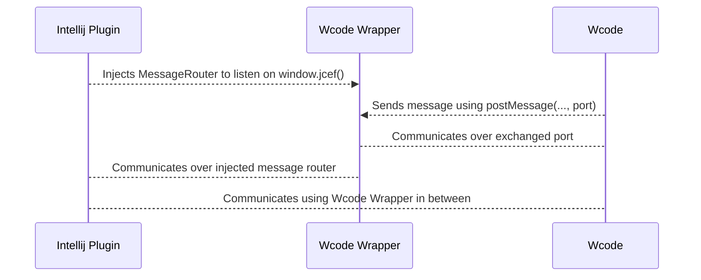

# Communication Architecture

The plugin uses a wrapper around the simulator webview (iframe), to establish communication with the plugin.
It essentially serves as communcation proxy between the plugin and webview, as the communication
requirements for both sides are different.

> **Wcode** is the VSCode version of the Wokwi Simulator

## Wcode

The url of the Wcode simulator is `https://wokwi.com/vscode/wcode?v=<version>`

E.g. `https://wokwi.com/vscode/wcode?v=2.4.0&g=10277ff&u=385442252248670209`
