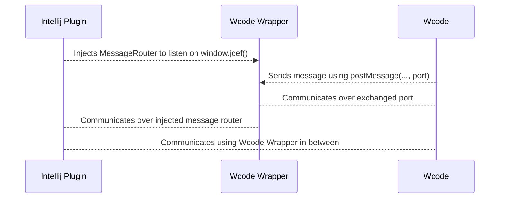

# Communication Architecture

The plugin uses a wrapper around the simulator webview (iframe), to establish communication with the plugin.
It essentially serves as communcation proxy between the plugin and webview, as the communication
requirements for both sides are different.

> **Wcode** is the VSCode version of the Wokwi Simulator

```mermaid
sequenceDiagram
    Intellij Plugin -->> Wcode Wrapper: Injects MessageRouter to listen on window.jcef()
    Wcode -->> Wcode Wrapper: Sends message using postMessage(..., port) 
    
    Wcode Wrapper --> Wcode: Communicates over exchanged port
    Intellij Plugin --> Wcode Wrapper: Communicates over injected message router
    
    Intellij Plugin --> Wcode: Communicates using Wcode Wrapper in between 
```

## Wcode

The url of the Wcode simulator is `https://wokwi.com/vscode/wcode?v=<version>`

E.g. `https://wokwi.com/vscode/wcode?v=2.4.0&g=10277ff&u=385442252248670209`

## Backend Transport Boundary

Simulator/session code talks to the browser through `core.ports.WokwiTransport`. This transport carries raw Wokwi
protocol payloads only. JCEF query injection, wrapper readiness events, and iframe details stay in the JCEF/UI layer.

The current JCEF implementation is `ui.jcef.JcefWokwiTransport`. It owns the injected JavaScript query bridge, routes
wrapper `wokwi` messages to transport listeners, and handles wrapper `meta` messages such as `frameLoaded` internally.

## Simulator Session Boundary

`core.session.WokwiSession` owns simulator protocol state and dispatch. It subscribes to `WokwiTransport`, waits for the
Wokwi readiness `start` message, sends typed startup/GDB/resource responses through `ProtocolCodec`, and emits session
callbacks for UI-facing events such as started, running, UART bytes, malformed messages, and unknown commands.

`services.WokwiSimulatorService` is currently the IntelliJ adapter/controller. It creates the JCEF view, maps
`WokwiArgs` into the pure session start config, owns the GDB bridge and resource loader adapters, and adapts session
events to IntelliJ console/tool-window listeners.
