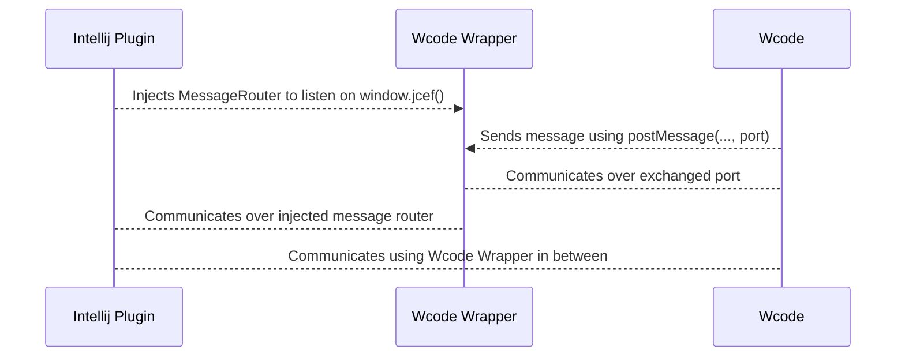

# Communication Architecture

The plugin uses a wrapper around the simulator webview (iframe), to establish communication with the plugin.
It essentially serves as communcation proxy between the plugin and webview, as the communication
requirements for both sides are different.

> **Wcode** is the VSCode version of the Wokwi Simulator

```mermaid
sequenceDiagram
    Intellij Plugin -->> Wcode Wrapper: Injects MessageRouter to listen on window.jcef()
    Wcode -->> Wcode Wrapper: Sends message using postMessage(..., port) 
    
    Wcode Wrapper --> Wcode: Communicates over exchanged port
    Intellij Plugin --> Wcode Wrapper: Communicates over injected message router
    
    Intellij Plugin --> Wcode: Communicates using Wcode Wrapper in between 
```

## Wcode

The url of the Wcode simulator is `https://wokwi.com/vscode/wcode?v=<version>`

E.g. `https://wokwi.com/vscode/wcode?v=2.4.0&g=10277ff&u=385442252248670209`

## Backend Transport Boundary

Simulator/session code talks to the browser through `core.ports.WokwiTransport`. This transport carries raw Wokwi
protocol payloads only. JCEF query injection, wrapper readiness events, and iframe details stay in the JCEF/UI layer.

The current JCEF implementation is `ui.jcef.JcefWokwiTransport`. It owns the injected JavaScript query bridge, routes
wrapper `wokwi` messages to transport listeners, and handles wrapper `meta` messages such as `frameLoaded` internally.
`ui.jcef.WokwiHtmlPageFactory` builds the wrapper HTML from resources in `resources/wokwi/wrapper`: `simulator.html`,
`bridge.css`, and `bridge.js`. The factory generates the Wokwi iframe URL, including the extension/Wcode version and
the license user id when available, instead of hardcoding those values in HTML.

The wrapper JavaScript follows the VS Code extension's message-port model: it waits for Wokwi's `start` handshake,
stores the transferred `MessagePort`, forwards IDE-to-Wokwi commands through that port, and forwards Wokwi-to-IDE
messages back through the JCEF query bridge. Unlike the VS Code webview wrapper, the IntelliJ wrapper does not use
VS Code-origin checks; it recognizes the Wokwi handshake by message shape (`command: "start"` plus a transferred
`port`).

## Simulator Session Boundary

`core.session.WokwiSession` owns simulator protocol state and dispatch. It subscribes to `WokwiTransport`, waits for the
Wokwi readiness `start` message, sends typed startup/GDB/resource responses through `ProtocolCodec`, and emits session
callbacks for UI-facing events such as started, running, UART bytes, malformed messages, and unknown commands.
The IntelliJ JCEF bridge intentionally sends firmware and resource bytes as base64, so Wokwi's `switchToBase64`
request is recognized and logged as informational rather than causing a binary/base64 mode switch.

Local simulator infrastructure is exposed to the session through `core.ports`: `GdbServer` supplies debugger connection,
break, message, and response forwarding, while `ResourceLoader` resolves Wokwi `loadResource` requests into bytes. This
keeps GDB/resource protocol handling in the session and leaves socket, URL, IDE notification, and disposal details in
adapter implementations. Concrete simulator-side adapters live under `simulator.services`, such as
`DefaultGdbServer`.

`ide.simulator.WokwiSessionController` is the IntelliJ adapter/controller. It creates the JCEF view through a runtime
factory, asks `services.SimulationConfigLoader` for loaded startup data, maps the pure `SimulationConfig` into the
session start config, coordinates concrete GDB/resource adapters, and dispatches session events to IntelliJ
subscribers through `WokwiSessionEventDispatcher`. IntelliJ-specific diagnostics live in a registered diagnostics
listener, while console rendering stays in process handlers that subscribe to pure `WokwiSession.Listener` events.
Actions, run configurations, macros, and file watchers use this controller directly.

Tool window presentation is handled by an IDE/UI lifecycle subscriber, not by the session controller directly.
`WokwiSimulationLifecycleDispatcher` publishes UI-level lifecycle events such as a simulator view becoming available
or the active simulation stopping. `ui.toolwindow.WokwiToolWindowPresenter` consumes those events and updates
the Swing tool window plus live tool-window icon on the EDT. These lifecycle events are separate from
`core.session.WokwiSession.Listener` because they carry UI components and must not leak Swing or JCEF concepts into
the pure core session layer.

Project configuration loading stays outside `core`: `config.WokwiProjectConfigResolver` parses `wokwi.toml`, resolves
project-relative firmware and diagram paths, and leaves browser/session runtime input as `core.model.SimulationConfig`.
