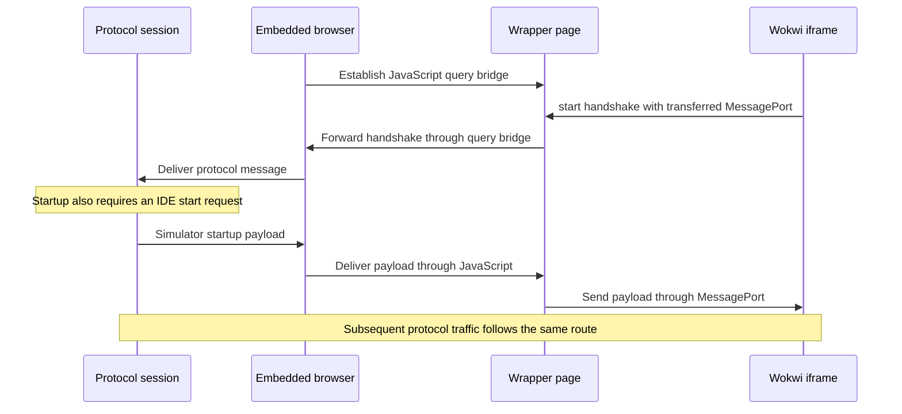
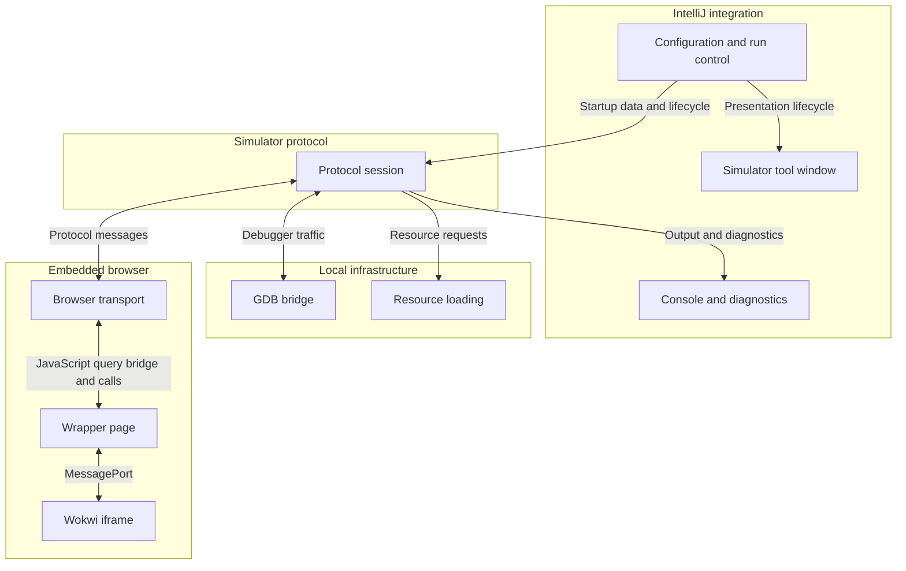

# Communication Architecture

The plugin embeds the Wokwi simulator in a JCEF browser. A wrapper page bridges the simulator's `MessagePort`
and the IDE's JavaScript query bridge, allowing the IDE and simulator to exchange Wokwi protocol messages.

## Communication Flow

Wokwi begins communication by sending a `start` handshake with a transferred message port. The wrapper retains
that port and forwards the handshake to the IDE. Once the IDE has also requested simulation startup, the session
sends the startup payload containing the diagram, firmware, license, and debugger settings.

```mermaid
sequenceDiagram
    participant Session as Protocol session
    participant Browser as Embedded browser
    participant Wrapper as Wrapper page
    participant Wokwi as Wokwi iframe

    Browser->>Wrapper: Establish JavaScript query bridge
    Wokwi->>Wrapper: start handshake with transferred MessagePort
    Wrapper->>Browser: Forward handshake through query bridge
    Browser->>Session: Deliver protocol message
    Note over Session: Startup also requires an IDE start request
    Session->>Browser: Simulator startup payload
    Browser->>Wrapper: Deliver payload through JavaScript
    Wrapper->>Wokwi: Send payload through MessagePort
    Note over Session,Wokwi: Subsequent protocol traffic follows the same route
```

The wrapper follows the message-port model used by the Wokwi VS Code extension. The simulator endpoint, known as
Wcode, is `https://wokwi.com/vscode/wcode?v=<version>`; its URL also carries extension metadata when available.

## Responsibilities and Boundaries

```mermaid
flowchart TB
    subgraph IDE["IntelliJ integration"]
        Control["Configuration and run control"]
        Output["Console and diagnostics"]
        View["Simulator tool window"]
    end
    subgraph Core["Simulator protocol"]
        Session["Protocol session"]
    end
    subgraph Infrastructure["Local infrastructure"]
        GDB["GDB bridge"]
        Resources["Resource loading"]
    end
    subgraph Browser["Embedded browser"]
        Transport["Browser transport"]
        Wrapper["Wrapper page"]
        Wokwi["Wokwi iframe"]
    end

    Control -->|Startup data and lifecycle| Session
    Control -->|Presentation lifecycle| View
    Session -->|Output and diagnostics| Output
    Session <-->|Debugger traffic| GDB
    Session -->|Resource requests| Resources
    Session <-->|Protocol messages| Transport
    Transport <-->|JavaScript query bridge and calls| Wrapper
    Wrapper <-->|MessagePort| Wokwi
```

The **IDE integration** loads project configuration, coordinates start and stop, owns the simulator and browser
lifetime, and presents output in the console and tool window.

The **protocol session** interprets Wokwi messages, sends startup data, handles resource requests, and forwards
debugger traffic. It stays independent of IntelliJ, Swing, JCEF, and concrete network implementations.

The **browser transport and wrapper** carry protocol messages between the session and iframe. Browser-specific
events, such as the wrapper finishing loading, remain within this layer.

The **local infrastructure** supplies resource bytes and a TCP endpoint for the IDE debugger. Debugging uses the
same browser communication route; see [GDB Debugging Architecture](GDB-Debugging-Architecture.md).

## Startup and Message Contracts

The iframe's `start` handshake means its communication channel is ready. Actual simulator status comes from
`sim:run`, `sim:pause`, and `sim:stop`. Debugger attachment waits for running or paused status with debugging enabled;
resource requests alone do not establish readiness.

Firmware and resource data travel as base64. Resource replies preserve request order because the protocol does
not include a request identifier. UART data, custom-chip output, and diagnostics are delivered to IDE consumers
without making the protocol session responsible for their presentation.

Stopping or replacing a simulator cancels obsolete startup work and releases its resources. Messages from retired
sessions cannot affect the current session. Attaching a console to an initialized debug session preserves that
session rather than starting it again.
