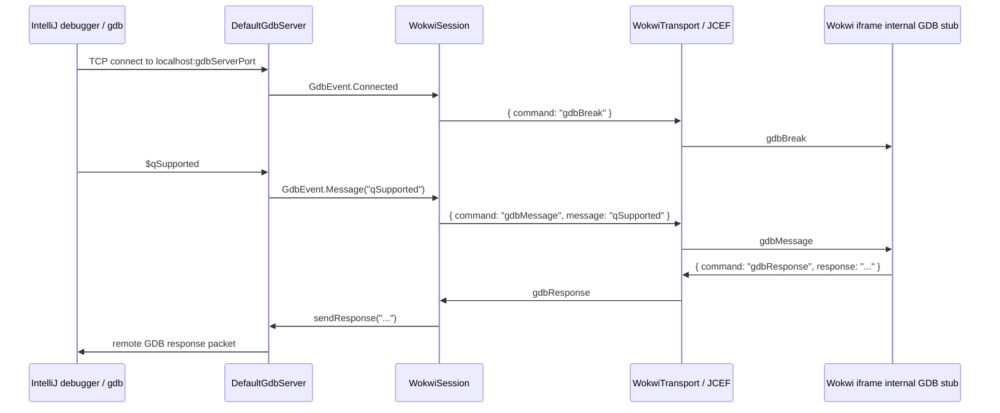

# GDB Debugging Architecture

The IntelliJ plugin exposes Wokwi debugging through a local GDB server plus the normal Wokwi browser protocol. The IDE
debugger connects to a localhost TCP port, but Wokwi's internal GDB stub stays inside the simulator iframe. The plugin
bridges the two by translating remote GDB protocol packets into Wokwi iframe messages.

This is a protocol tunnel, not a direct TCP connection from IntelliJ to Wokwi.



## Component Boundaries

`DefaultGdbServer` is the local TCP adapter. It listens on the configured `gdbServerPort`, accepts one active debugger
connection, parses remote GDB protocol packets, validates checksums, emits `GdbEvent` values, and writes Wokwi responses
back to the debugger socket.

`GdbClientConnection` is the private per-socket handler inside `DefaultGdbServer`. It owns the low-level remote GDB
protocol framing for one debugger connection: `$message#checksum`, ACK/NAK, detach, and Ctrl-C break handling.

`core.ports.GdbServer` is the session-facing port. Core code does not depend on sockets or IntelliJ APIs; it only sees
debugger-side events and can send responses back through the port.

`WokwiSession` owns the Wokwi-facing protocol mapping:

- `GdbEvent.Connected` -> `gdbBreak`
- `GdbEvent.Break` -> `gdbBreak`
- `GdbEvent.Message(packet)` -> `gdbMessage`
- inbound `gdbResponse` -> `GdbServer.sendResponse(response)`

`JcefWokwiTransport` is the browser transport. It forwards raw Wokwi protocol JSON between `WokwiSession` and the
wrapper page, which forwards those messages to the Wokwi iframe.

## Startup Flow

When starting with debugger support, `WokwiSimulatorService` loads the project simulation config and configures
`DefaultGdbServer` before creating the session. The server binds synchronously, so the actual bound port is available
before the simulator start payload is sent.

`WokwiSessionStartConfig.gdbPort` is included in the Wokwi `start` payload. This preserves the VS Code-compatible
startup shape and tells Wokwi that debugger integration is active for the session.

The debugger-side run configuration uses the `WokwiGdbServer` macro to resolve the local attach address:

```text
localhost:<gdbServerPort>
```

If a random port is used, the macro reads the bound port from `WokwiSimulatorService.getRunningGDBPort()`.

## Why This Bridge Exists

Wokwi's simulator and internal GDB stub run inside the embedded browser iframe. A native IntelliJ debugger cannot attach
directly to that in-browser stub over TCP. Instead, the plugin provides the TCP endpoint expected by GDB locally and
forwards packet bodies over the same IDE-to-Wokwi message channel used by the simulator.

This keeps each layer narrow:

- IntelliJ/debugger side speaks remote GDB protocol over TCP.
- `DefaultGdbServer` adapts TCP packets into typed `GdbEvent`s.
- `WokwiSession` adapts typed GDB events into Wokwi protocol messages.
- JCEF/browser code only transports JSON payloads and does not know GDB semantics.

## Lifecycle

`WokwiSimulatorService` owns concrete adapter lifecycle. It creates `DefaultGdbServer`, registers it with the project
disposable, and disposes it when debugging stops or the simulator service shuts down.

`WokwiSession` owns only its subscription to `GdbServer.events`. Disposing a session cancels that collection and
unsubscribes from the browser transport. It does not close the local GDB server directly; server disposal remains a
caller-side lifecycle decision.
