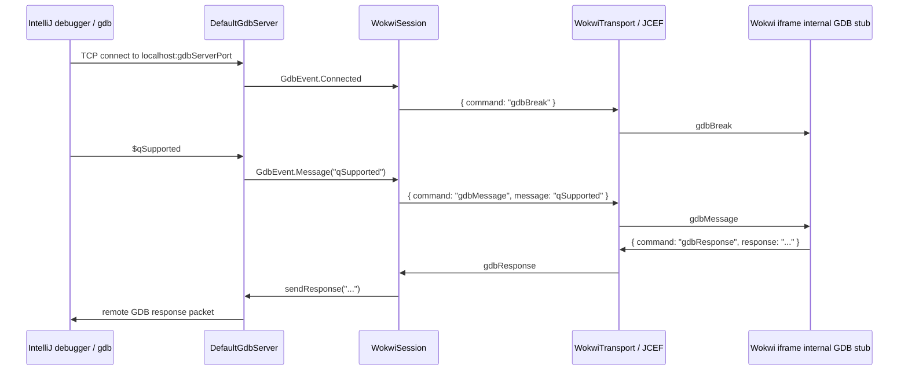

# GDB Debugging Architecture

The IntelliJ plugin exposes Wokwi debugging through a local GDB server plus the normal Wokwi browser protocol. The IDE
debugger connects to a localhost TCP port, but Wokwi's internal GDB stub stays inside the simulator iframe. The plugin
bridges the two by translating remote GDB protocol packets into Wokwi iframe messages.

This is a protocol tunnel, not a direct TCP connection from IntelliJ to Wokwi.


```mermaid
sequenceDiagram
    participant Debugger as IntelliJ debugger / gdb
    participant LocalServer as DefaultGdbServer
    participant Session as WokwiSession
    participant Transport as WokwiTransport / JCEF
    participant Wokwi as Wokwi iframe internal GDB stub

    Debugger->>LocalServer: TCP connect to localhost:gdbServerPort
    LocalServer->>Session: GdbEvent.Connected
    Session->>Transport: { command: "gdbBreak" }
    Transport->>Wokwi: gdbBreak

    Debugger->>LocalServer: $qSupported#...
    LocalServer->>Session: GdbEvent.Message("qSupported")
    Session->>Transport: { command: "gdbMessage", message: "qSupported" }
    Transport->>Wokwi: gdbMessage
    Wokwi->>Transport: { command: "gdbResponse", response: "..." }
    Transport->>Session: gdbResponse
    Session->>LocalServer: sendResponse("...")
    LocalServer->>Debugger: remote GDB response packet
```

## Component Boundaries

`DefaultGdbServer` is the local TCP adapter. It listens on the configured `gdbServerPort`, accepts one active debugger
connection, parses remote GDB protocol packets, validates checksums, emits `GdbEvent` values, and writes Wokwi responses
back to the debugger socket.

`GdbClientConnection` is the private per-socket handler inside `DefaultGdbServer`. It owns the low-level remote GDB
protocol framing for one debugger connection: `$message#checksum`, ACK/NAK, detach, and Ctrl-C break handling.

`core.ports.GdbServer` is the session-facing port. Core code does not depend on sockets or IntelliJ APIs; it only sees
debugger-side events and can send responses back through the port.

`WokwiSession` owns the Wokwi-facing protocol mapping:

- `GdbEvent.Connected` -> `gdbBreak`
- `GdbEvent.Break` -> `gdbBreak`
- `GdbEvent.Message(packet)` -> `gdbMessage`
- inbound `gdbResponse` -> `GdbServer.sendResponse(response)`

`JcefWokwiTransport` is the browser transport. It forwards raw Wokwi protocol JSON between `WokwiSession` and the
wrapper page, which forwards those messages to the Wokwi iframe.

## Startup Flow

When starting with debugger support, `ide.simulator.WokwiSessionController` loads the project simulation config and asks
`WokwiGdbServerManager` to configure `DefaultGdbServer` before creating the session. The server binds synchronously, so
the actual bound port is available before the simulator start payload is sent.

`WokwiSessionStartConfig.gdbPort` is included in the Wokwi `start` payload. This preserves the VS Code-compatible
startup shape and tells Wokwi that debugger integration is active for the session.

The debugger-side run configuration uses the `WokwiGdbServer` macro to resolve the local attach address:

```text
localhost:<gdbServerPort>
```

If a random port is used, the macro reads the bound port from `WokwiSessionController.getRunningGDBPort()`.

The debugger's before-run task creates a fresh readiness wait for every execution. It proceeds only after Wokwi sends
`sim:run` or `sim:pause` for the debug start. A paused simulator is initialized and ready for attach even when its board
does not request external resources. Configuration failure, GDB bind failure, resource failure, stop, or runtime
replacement ends the wait with failure. A 30-second timeout covers both startup work and the acknowledgement wait;
timeout and IDE cancellation stop that request without stopping a newer request. The synchronous before-run API uses
IntelliJ's `runBlockingMaybeCancellable` bridge: it propagates cancellation when the caller supplies a job or progress
indicator, and also supports CLion's legacy executor, which may supply neither. The controller's 30-second deadline
bounds startup in that raw executor context.
Before reporting success, the controller checks that the acknowledged request is still current and has not failed;
stop, replacement, or failure can invalidate readiness while the waiting caller is scheduled to resume.

The sequence below shows a successfully prepared debug runtime and the readiness decision. Configuration or binding
failure exits before browser creation. Browser arrows follow the transport route shown in
[Communication Architecture](Communication-Architecture.md); factory and manager calls are abbreviated here.

```mermaid
sequenceDiagram
    participant Task as Debug before-run task
    participant Controller as Session controller
    participant Server as Local GDB server
    participant Session as WokwiSession
    participant Wokwi as Wokwi iframe

    Task->>Controller: startDebuggerAndAwaitReady()
    Note over Task,Wokwi: 30-second deadline covers setup and simulator acknowledgement
    Controller->>Controller: Load configuration
    Controller->>Server: Configure through GdbServerManager
    Server-->>Controller: Actual bound port
    Controller->>Session: Create runtime and request start
    Wokwi->>Session: start (iframe handshake)
    Session->>Wokwi: start payload with pause=true and bound gdbPort
    Note over Task,Wokwi: Handshake and resource requests do not complete readiness

    alt Simulator initialized
        Wokwi-->>Session: sim:pause or sim:run
        Session-->>Controller: onDebuggerReady()
        Controller-->>Task: true
        Note over Task,Controller: Attach Run console without restarting; debugger may connect
    else Stop, replacement, resource/GDB error, or timeout
        Controller->>Controller: Stop failed request only if still current
        Controller-->>Task: false
    end
```

IDE cancellation propagates cancellation to the before-run caller and stops its request. A newer request remains
unaffected by cleanup of an older readiness wait.

## Why This Bridge Exists

Wokwi's simulator and internal GDB stub run inside the embedded browser iframe. A native IntelliJ debugger cannot attach
directly to that in-browser stub over TCP. Instead, the plugin provides the TCP endpoint expected by GDB locally and
forwards packet bodies over the same IDE-to-Wokwi message channel used by the simulator.

This keeps each layer narrow:

- IntelliJ/debugger side speaks remote GDB protocol over TCP.
- `DefaultGdbServer` adapts TCP packets into typed `GdbEvent`s.
- `WokwiSession` adapts typed GDB events into Wokwi protocol messages.
- JCEF/browser code only transports JSON payloads and does not know GDB semantics.

## Lifecycle

`WokwiGdbServerManager` owns concrete GDB adapter lifecycle for `WokwiSessionController`. It creates
`DefaultGdbServer`, registers it with the project disposable, and disposes it when debugging stops or the simulator
controller shuts down.

A running server is reused when the requested port is absent or matches its actual bound port. Its event channel
remains stable across session replacement, so an already connected debugger can continue sending packets after the
old session collector is cancelled and a new one subscribes. A different explicit port requires a new server. Binding
returns a result synchronously; on failure the manager disposes the candidate and reports the error before the browser
is created. The server owns its accept/read/response jobs and cancels them along with its sockets on close, leaving the
parent scope active.

`WokwiSession` owns only its subscription to `GdbServer.events`. Disposing a session cancels that collection and
unsubscribes from the browser transport. It does not close the local GDB server directly; server disposal remains a
caller-side lifecycle decision.
